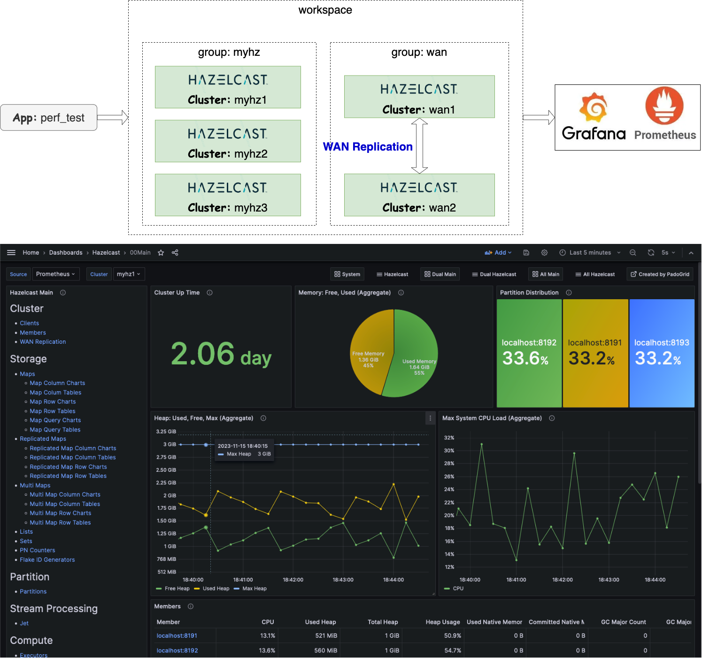

 [*PadoGrid*](https://github.com/padogrid) | [*Catalogs*](https://github.com/padogrid/catalog-bundles/blob/master/all-catalog.md) | [*Manual*](https://github.com/padogrid/padogrid/wiki) | [*FAQ*](https://github.com/padogrid/padogrid/wiki/faq) | [*Releases*](https://github.com/padogrid/padogrid/releases) | [*Templates*](https://github.com/padogrid/padogrid/wiki/Using-Bundle-Templates) | [*Pods*](https://github.com/padogrid/padogrid/wiki/Understanding-Padogrid-Pods) | [*Kubernetes*](https://github.com/padogrid/padogrid/wiki/Kubernetes) | [*Docker*](https://github.com/padogrid/padogrid/wiki/Docker) | [*Apps*](https://github.com/padogrid/padogrid/wiki/Apps) | [*Quick Start*](https://github.com/padogrid/padogrid/wiki/Quick-Start)

---

<!-- Platforms -->
[](https://github.com/padogrid/padogrid/wiki/Platform-PadoGrid-1.x) [](https://github.com/padogrid/padogrid/wiki/Platform-Host-OS)

# Hazelcast Multi-Cluster Demo

This bundle demonstrates Grafana capabilities of monitoring five (5) Hazelcast clusters. It includes three (3) independent clusters and two (2) bi-directional WAN clusters along with a workflow simulator.

## Installing Bundle

```bash
install_bundle -init -download -workspace bundle-hazelcast-5-cluster-wan-app-grafana
```

## Use Case

Hazelcast provides a wealth of monitoring metrics that can be scraped by Prometheus for creating Grafana dashboards. In this bundle, we use PadoGrid's own Grafana dashboards to demonstrate the ease of monitoring multiple clusters.



## Required Software

- Hazelcast
  - Full Demo: Enterprise 5.x
  - Partial Demo: OSS 5.x (WAN not demonstrable)
- Grafana 10.x
- Prometheus 2.x
- [`jq`](https://jqlang.github.io/jq/download/)

## Required Hardware

- Memory per cluster: 3 GB
  - There are a total of five (5) clusters configured. You can run more or less clusters as you wish.
  - 5 clusters: 15 GB
- CPUs: 4

## Bundle Contents

```console
apps
├── grafana
└── perf_test

clusters
├── myhz1
├── myhz2
├── myhz3
├── wan1
└── wan2

groups
├── myhz
└── wan
```

## Installation Steps

### Prometheus/Grafana

Install Prometheus and Grafana. Make sure you have installed PadoGrid 0.9.31 or a later version.

```bash
install_padogrid -product prometheus
install_padogrid -product grafana-enterprise
update_padogrid -product prometheus
update_padogrid -product grafana
```

### `jq`

The JSON processor, `jq`, is required if you want to create or update dashboard templates. You can download it from [here](https://jqlang.github.io/jq/download/).

## Used Ports

The following ports are used by this demo.

- Grafana: 3000
- Prometheus: 9090, 9091
- Hazelcast
  - `myhz1`: [5701-5720], [8291-8300], [9401-9420], [12201-12220]
  - `myhz2`: [5801-5820], [8391-8400], [9501-9520], [12301-12320]
  - `myhz3`: [5901-5920], [8491-8500], [9601-9620], [12401-12420]
  - `wan1`: [6001-6020], [8591-8600], [9701-9720], [12501-12520]
  - `wan2`: [6101-6120], [8691-8700], [9801-9820], [12601-12620]

## Startup Sequence

### 1. Start all clusters in the workspace.

There are two (2) groups of clusters as follows.

| Group  | Clusters                  | Hazelcast           |
| ------ | ------------------------- | ------------------- |
| `myhz` | `myhz1`, `myhz2`, `myhz3` | OSS or Enterprise   |
| `wan ` | `wan1`, `wan2`            | Enterprise required |

The `wan1` and `wan2` clusters are configured with bi-directional WAN replication. These clusters require Hazelcast Enterprise.

✏️  Always start the `wan` group first before the `myhz` group to allocate the native memory for its clusters. Both clusters, `wan1` and `wan2` are configured with 512 MB of native memory per member.

```bash
# Start group 'wan' - these clusters require Hazelcast Enterprise
start_group -group wan

# Start group 'myhz'
start_group -group myhz
```

To check group cluster status:

```bash
show_group -group wan
show_group -group myhz
```

### 2. Start Prometheus and Grafana

Start Prometheus for monitoring the `myhz1`, `myhz2`, and `myhz3` clusters. Also, start Grafana.

```bash
cd_app grafana/bin_sh
./start_prometheus
./start_grafana
```

If you have Hazelcaast Enterprise installed, then start Prometheus for monitoring the `wan1` and  `wan2` clusters.

```bash
cd_app grafana/bin_sh
./start_prometheus_wan
```

### 3. Import PadoGrid dashboards

Import all the dashboards by executing `import_folder` as follows.

```bash
cd_app grafana/bin_sh
./import_folder -all
```

### 4. Open Grafana in the browser

Grafana URL: <http://localhost:3000>

From the browser, add a Prometheus datasource for `myhz` clusters if it does not exist.

- Select *Connections/Add new connection* from the left pull-out menu.
- Search and add `Promtheus` from the *Add new connection* page.
- Enter the following

  Prometheus server URL: <http://localhost:9090>
- Select *Save & test* at the bottom.
- If you have the `wan` clusters running, then add another Prometheus datasource with the following URL. You can use any name.
  
  Prometheus server URL: <http://localhost:9091>

	Alternatively, if you are using PadoGrid v0.9.33+, then you can add a new Prometheus datasource as follows.

	```bash
	cd_app grafana/bin_sh
	./create_datasource_prometheus -datasource Prometheus-WAN -url http://localhost:9091
	```

Open the **00Main** dashboard.

- Select *Dashboards* from the left pull-out menu.
- Select *Hazelcast*.
- Select **00Main**.

The **00Main** dashboard is the main (home) dashboard that provides a menu of all available dashaboards for displaying a single cluster at a time. From there, you can navigate to **00MainDual** for monitoring two (2) clusters side-by-side and **00MainAll** for monitoring all clusters in federated views. See [Navigating Hazelcast Dashboards](#navigating-hazelcast-dashboards) for dashboard instructions.

### 5. Simulate workflows

The included `etc/group-workflow.properties` file simulates workflows by executing various Hazelcast data structure operations. You can run it per cluster as follows.

```bash
cd_app perf_test/bin_sh

# wan1
./test_group -run -prop ../etc/group-workflow.properties -cluster wan1

# wan2
./test_group -run -prop ../etc/group-workflow.properties -cluster wan2

# myhz1
./test_group -run -prop ../etc/group-workflow.properties -cluster myhz1

# myhz2
./test_group -run -prop ../etc/group-workflow.properties -cluster myhz2

# myhz3
./test_group -run -prop ../etc/group-workflow.properties -cluster myhz3
```

To test native memory, use `group-nmap.properties` as follows.

```bash
# wan1
./test_group -run -prop ../etc/group-nmap.properties -cluster wan1

# wan2
./test_group -run -prop ../etc/group-nmap.properties -cluster wan2
```

To test the included WAN Discovery plugin, run one of the following commands. These commands run indefinitely so that you can monitor the progress from Grafana. 

✏️  *You can monitor the WAN Discovery plugin by selecting the **WAN Discovery Plugin** row in the WAN Replication dashboard.*

```bash
cd_app perf_test/bin_sh

# wan1
./test_group -cluster wan1 -run -prop ../etc/group-mkp.properties
./test_group -cluster wan1 -run -prop ../etc/group-mkq.properties

# wan2
./test_group -cluster wan2 -run -prop ../etc/group-mkp.properties
./test_group -cluster wan2 -run -prop ../etc/group-mkq.properties
```

The `perf_test` app supports only the following data structures.

- Map
- Queue
- ReplicatedMap
- Reliable Topic
- Topic

The following unsupported data structures can be ingested using the [Hazelcast Playground](https://github.com/padogrid/bundle-hazelcast-5-playground-python) bundle.

- MultiMap
- List
- Set
- PN Counter
- Fake ID Generator

## Navigating Hazelcast Dashboards

The main dashboard is organized similar to the Management Center.

The left pane contains menu items for cluster members, WAN, storage, stream processing, computing, messaging, and CP subsystem. You can drill down to individual menu items by clicking on them.

The toolbar contains the menu for switching cluster, opening the system dashboard, and directly selecting any of the Hazelcast dashboards.

Each dashboard's toolbar contains the *Main* menu item for quickly returning to the main dashboard.

The **System** dashboard tabulates member status and provides two rows of panels: *Aggreates* and *Per Member*. The Aggregates row contains panels for monitoring aggreated metrics. The Per Member row contains panels for monitoring individual members.

The **Member** dashboard provides two (2) rows of panels: *Resources* and *Data Structures*. The Resources row contains panels for monitoring the selected member's system resources. The Data Structures row contains panels for monitoring the data strcutures that belong to the selected member. You can switch to another member using the *Member* pulldown menu in the toolbar.

The **WAN Replication** dashboard includes the WAN Discolvery Plugin row which contains panels that display the custom metrics published by the WAN discovery plugin maintained by Sorint.lab. This plugin reduces the WAN discovery latency by 1000 folds, significantly increasing the overall performance of each Hazelcast member.

## Adding/Deleting Clusters

### Adding a cluster

Adding a new Hazelcast cluster requires the following steps.

1. Create a cluster with a non-conflicting starting port number.
2. Configure and restart Prometheus to scrape the new cluster metrics.
3. Update the Grafana dashboard templates to include the new cluster.
4. Re-import the dashboard templates to Grafana.

### Deleting a cluster

Deleting a Hazelcast cluster requires the following steps.

1. Stop and remove the cluster from the workspace by executing `stop-cluster` and `remove_cluster`, respectively.
1. Remove the cluster entry identified by the `job_name` attribute in the Prometheus configuration file.
1. Update the Grafana dashboard templates to execlude the deleted cluster.
1. Re-import the dashboard templates to Grafana.

### Example: Add a new cluster

1. The following command create a cluster named, `myhz4` with the starting port number 6201.

```bash
# Create 'myhz4' cluster
create_cluster -product hazelcast -cluster myhz4 -port 6201

# By default, the new cluster has two (2) members. The following adds one additional member.
add_member
```

2. Configure Prometheus

The `create_cluster` command automatically bumps up (or down) the starting port number for Prometheus based on the starting Hazelcast port number. You can get the Prometheus port number by executing `show_cluster -long`.

```bash
show_cluster -long -cluster myhz4
```

Output:

```console
----------------------------------------------------------------
         CLUSTER: myhz4
     CLUSTER_DIR: /Users/dpark/Padogrid/workspaces/rwe-hazelcast/bundle-hazelcast-5-cluster-wan-app-granfana/clusters/myhz4
         PRODUCT: hazelcast
    CLUSTER_TYPE: hazelcast
             POD: local
        POD_TYPE: local

01        Member: myhz4-padomac.local-01
           STATE: Down
             PID: N/A
     MEMBER_PORT: 6201
      DEBUG_PORT: 9901
 PROMETHEUS_PORT: 8791
         JMX_URL: service:jmx:rmi:///jndi/rmi://padomac.local:12701/jmxrmi
     Working Dir: /Users/dpark/Padogrid/workspaces/rwe-hazelcast/bundle-hazelcast-5-cluster-wan-app-granfana/clusters/myhz4/run/myhz4-padomac.local-01
        LOG_FILE: /Users/dpark/Padogrid/workspaces/rwe-hazelcast/bundle-hazelcast-5-cluster-wan-app-granfana/clusters/myhz4/log/myhz4-padomac.local-01.log
...
```

From the above output we see the first member has the Prometheus port number of 8791. Add the following in `etc/prometheus.yml`.

```bash
cd_app grafana
vi etc/prometheus.yml
```

Edit `etc/prometheus.yaml`:

```yaml
scrape_configs:
...
  - job_name: 'myhz4'
    scrape_interval: 2s
    static_configs:
    static_configs:
      - targets: [localhost:8791, localhost:8792, localhost:8793, localhost:8794, localhost:8795, localhost:8796, localhost:8797, localhost:8798, localhost:8799, localhost:8800]
```

✏️  *Note that we set the `job_name` attribute to the cluster name, `myhz4`. The dashboard templates filter clusters by the value of this attribute.*

Now, restart Prometheus.

```bash
cd_app grafana/bin_sh
./stop_prometheus
./start_prometheus
```

You should now see six (6) clusters in Grafana.

## Teardown

```bash
# Stop Prometheus and Grafana
cd_app grafana/bin_sh
# '-all' stops both myhz and wan Prometheus instances
./stop_prometheus -all
./stop_granfa

# Stop all clusters in the workspace
stop_workspace -all
```

## References

1. [*PadoGrid Hazelcast Dashboards in Docker/Kubernetes*](<https://hub.docker.com/repository/docker/padogrid/padogrid-grafana/general#3-hazelcast>), PadoGrid Hazelcast Dashboards installation via container
1. [*Hazelcast Grafana App*](<https://github.com/padogrid/padogrid/wiki/Hazelcast-Grafana-App>), PadoGrid app
1. [*Hazelcast Kubernetes Helm Charts*](<https://github.com/padogrid/bundle-hazelcast-3n4n5-k8s-kubectl_helm>), PadoGrid Bundles
1. [*Grafana*](<https://grafana.com/>), GrafanaLabs
1. [*Prometheus*](<https://prometheus.io/>), Prometheus

---

 [*PadoGrid*](https://github.com/padogrid) | [*Catalogs*](https://github.com/padogrid/catalog-bundles/blob/master/all-catalog.md) | [*Manual*](https://github.com/padogrid/padogrid/wiki) | [*FAQ*](https://github.com/padogrid/padogrid/wiki/faq) | [*Releases*](https://github.com/padogrid/padogrid/releases) | [*Templates*](https://github.com/padogrid/padogrid/wiki/Using-Bundle-Templates) | [*Pods*](https://github.com/padogrid/padogrid/wiki/Understanding-Padogrid-Pods) | [*Kubernetes*](https://github.com/padogrid/padogrid/wiki/Kubernetes) | [*Docker*](https://github.com/padogrid/padogrid/wiki/Docker) | [*Apps*](https://github.com/padogrid/padogrid/wiki/Apps) | [*Quick Start*](https://github.com/padogrid/padogrid/wiki/Quick-Start)
