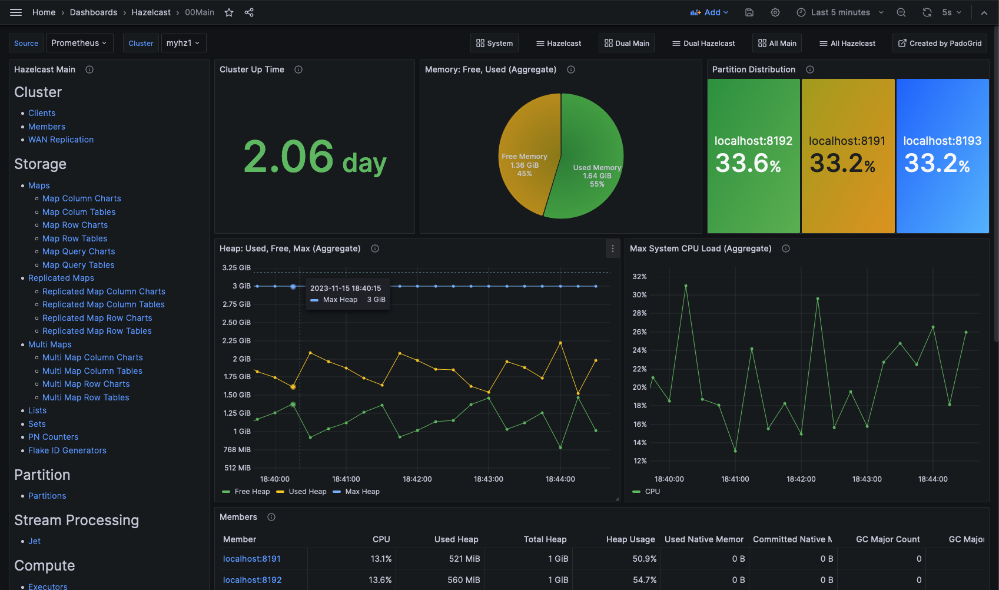

 [*PadoGrid*](https://github.com/padogrid) | [*Catalogs*](https://github.com/padogrid/catalog-bundles/blob/master/all-catalog.md) | [*Manual*](https://github.com/padogrid/padogrid/wiki) | [*FAQ*](https://github.com/padogrid/padogrid/wiki/faq) | [*Releases*](https://github.com/padogrid/padogrid/releases) | [*Templates*](https://github.com/padogrid/padogrid/wiki/Using-Bundle-Templates) | [*Pods*](https://github.com/padogrid/padogrid/wiki/Understanding-Padogrid-Pods) | [*Kubernetes*](https://github.com/padogrid/padogrid/wiki/Kubernetes) | [*Docker*](https://github.com/padogrid/padogrid/wiki/Docker) | [*Apps*](https://github.com/padogrid/padogrid/wiki/Apps) | [*Quick Start*](https://github.com/padogrid/padogrid/wiki/Quick-Start)

---

<!-- Platforms -->
[](https://github.com/padogrid/padogrid/wiki/Platform-Host-OS) [](https://github.com/padogrid/padogrid/wiki/Platform-VM) [](https://github.com/padogrid/padogrid/wiki/Platform-Docker) [](https://github.com/padogrid/padogrid/wiki/Platform-Kubernetes)

# Hazelcast Multi-Cluster Demo

This bundle demonstrates Grafana capabilities of monitoring four (4) Hazelcast clusters.

## Installing Bundle

```bash
install_bundle -init -download -workspace bundle-hazelcast-5-cluster-wan-app-granfana
```

## Use Case

Hazelcast provides a wealth of monitoring metrics that can be scraped by Prometheus for creating Grafana dashboards. In this bundle, we use PadoGrid's own Grafana dashboards to demonstrate the ease of monitoring multiple clusters.


## Required Software

- PadoGrid 0.9.30+
- Hazelcast
  - Full Demo: Enterprise 5.x
  - Partial Demo: OSS 5.x (WAN not demonstrable)
- Grafana 10.x
- Prometheus 2.x

## Required Hardware

- Memory per cluster: 3 GB
  - There are a total of four (4) clusters. You can run any number of clusters.
  - 4 clusters: 12 GB
- CPUs: 4

## Bundle Contents

```console
apps
├── grafana
└── perf_test

clusters
├── myhz1
├── myhz2
├── wan1
└── wan2

groups
├── myhz
└── wan
```

## Installation Steps

Install Prometheus and Grafana. Make sure you have installed PadoGrid 0.9.30 or a later version.

```bash
install_padogrid -product prometheus
install_padogrid -product grafana
update_products -product prometheus
update_products -product grafana
```

## Used Ports

The following ports are used by this demo.

- Grafana: 3000
- Prometheus: 9090
- Hazelcast
  - `myhz1`: [5601-5620], [8191-8200], [9301-9320], [12101-12120]
  - `myhz2`: [5701-5720], [8291-8300], [9401-9420], [12201-12220]
  - `wan1`: [5801-5820], [8391-8400], [9501-9520], [12301-12320]
  - `wan2`: [5901-5920], [8491-8500], [9601-9620], [12401-12420]

## Startup Sequence

### 1. Start all clusters in the workspace.

There are two (2) groups of clusters as follows.

| Group  | Clusters         | Hazelcast           |
| ------ | ---------------- | ------------------- |
| `myhz` | `myhz1`, `myhz2` | OSS or Enterprise   |
| `wan ` | `wan1`, `wan2`   | Enterprise required |

The `wan1` and `wan2` clusters are configured with bi-directional WAN replication. These clusters require Hazelcast Enterprise.

```bash
# Start group 'myhz'
start_group -group myhz

# Start group 'wan' - these clusters required Hazelcast Enterprise
start_group -group wan
```

### 2. Start Prometheus and Grafana

```bash
cd_app grafana/bin_sh
./start_prometheus
./start_grafana
```

### 3. Import dashboards

```bash
cd_app grafana/bin_sh
./import_dashboard -all
```

### 4. Open Grafana in the browser.

Grafana URL: <http://localhost:3000>

From the browser, add the Prometheus datasource if it does not exist.

- Select *Connections/Add new connection* from the left pull-out menu.
- Search and add `Promtheus` from the *Add new connection* page.
- Enter the following

  Prometheus server URL: <http://localhost:9090>
- Select *Save & test* at the bottom

Open the **00Main** dashboard.

- Select *Dashboards* from the left pull-out menu.
- Select *Hazelcast*.
- Select **00Main**.

The **00Main** dashboard is the main (home) dashboard that provides a menu of all available dashaboards. See [Navigating Hazelcast Dashboards](#navigating-hazelcast-dashboards) for dashboard instructions.

### 5. Ingest Data

There are four (4) `perf_test` apps included in the bundle. Each app targets their respective cluster for ingesting data.

To ingest data into data structures, run the `ingest_all` script from the `perf_test/bin_sh` directory as follows.

```bash
cd_app perf_test/bin_sh

# myhz1
./ingest_all -cluster myhz1

# myhz2
./ingest_all -cluster myhz2

# wan1
./ingest_all -cluster wan1

# wan2
./ingest_all -cluster wan2
```

For testing the included WAN plugin, run one of the following commands. These commands run indefinitely so that you can monitor the progress from Grafana. 

✏️  *The WAN plugin dashboard called Custom is in the **WAN Discovery** folder.*

```bash
cd_app perf_test/bin_sh

# wan1
./test_group -cluster wan1 -run -prop ../etc/group-mkp.properties
./test_group -cluster wan1 -run -prop ../etc/group-mkq.properties

# wan2
./test_group -cluster wan2 -run -prop ../etc/group-mkp.properties
./test_group -cluster wan2 -run -prop ../etc/group-mkq.properties
```


The `perf_test` app supports only the following data structures.

- Map
- Queue
- ReplicatedMap
- Reliable Topic
- Topic

The following unsupported data structures can be ingested using the [Hazelcast Playground](https://github.com/padogrid/bundle-hazelcast-5-playground-python) bundle.

- MultiMap
- List
- Set
- PN Counter
- Fake ID Generator

## Navigating Hazelcast Dashboards

The main dashboard is organized similar to the Management Center.

The left pane contains menu items for cluster members, WAN, storage, stream processing, computing, messaging, and CP subsystem. You can drill down to individual menu items by clicking on them.

The toolbar contains the menu for switching cluster, opening the system dashboard, and directly selecting any of the Hazelcast dashboards.

Each dashboard's toolbar cantains the *Main* menu item for quickly returning to the main dashboard.

The **System** dashboard tabulates member status and provides two rows of panels: *Aggreates* and *Per Member*. The Aggregates row contains panels for monitoring aggreated metrics. The Per Member row contains panels for monitoring individual members.

The **Member** dashboard provides two (2) rows of panels: *Resources* and *Data Structures*. The Resources row contains panels for monitoring the selected member's system resources. The Data Structures row contains panels for monitoring the data strcutures that belong to the selected member. You can switch to another member using the *Member* pulldown menu in the toolbar.

## Screenshot



## Teardown

```bash
stop_workspace -all
```

## References

1. *Hazelcast Grafana App*, Padogrid, <https://github.com/padogrid/padogrid/wiki/Hazelcast-Grafana-App>
1. *Hazelcast Kubernetes Helm Charts*, PadoGrid Bundles, <https://github.com/padogrid/bundle-hazelcast-3n4n5-k8s-kubectl_helm>
1. *Grafana*, GranfnaLabs, <https://grafana.com/>
1. *Prometheus*, Prometheus, <https://prometheus.io/>

---

 [*PadoGrid*](https://github.com/padogrid) | [*Catalogs*](https://github.com/padogrid/catalog-bundles/blob/master/all-catalog.md) | [*Manual*](https://github.com/padogrid/padogrid/wiki) | [*FAQ*](https://github.com/padogrid/padogrid/wiki/faq) | [*Releases*](https://github.com/padogrid/padogrid/releases) | [*Templates*](https://github.com/padogrid/padogrid/wiki/Using-Bundle-Templates) | [*Pods*](https://github.com/padogrid/padogrid/wiki/Understanding-Padogrid-Pods) | [*Kubernetes*](https://github.com/padogrid/padogrid/wiki/Kubernetes) | [*Docker*](https://github.com/padogrid/padogrid/wiki/Docker) | [*Apps*](https://github.com/padogrid/padogrid/wiki/Apps) | [*Quick Start*](https://github.com/padogrid/padogrid/wiki/Quick-Start)
